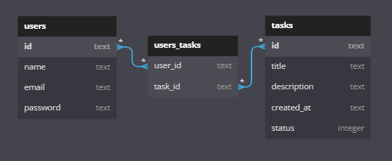

# Projeto Backend - To-do List 

API de gestão de tarefas de uma empresa, onde é possível cadastrar membros e tarefas da equipe.  
Aplicação back-end de servidor express com banco de dados SQLite3. 

### BANCO DE DADOS

## 📜 Documentação

https://documenter.getpostman.com/view/24460805/2s8ZDeSJGq

## 🕹 Endpoints

USERS
- GET All Users;
- POST Create User;
- DEL Delete User;

TASKS
- GET All Tasks;
- GET Tasks with users;
- POST Create Task;
- POST Add user to task by id;
- PUT Edit Task;
- DEL Delete Task;
- DEL Delete user from task by ids;

## 🛠 Tecnologias Utilizadas

- NodeJS
- Typescript
- Express
- SQL e SQLite
- Knex
- Postman

## 👩‍💻 Pessoa autora

Laís Rodrigues Macedo
📧 laisrodriguesmacedo@gmail.com
📞 (+49) 174 7781517